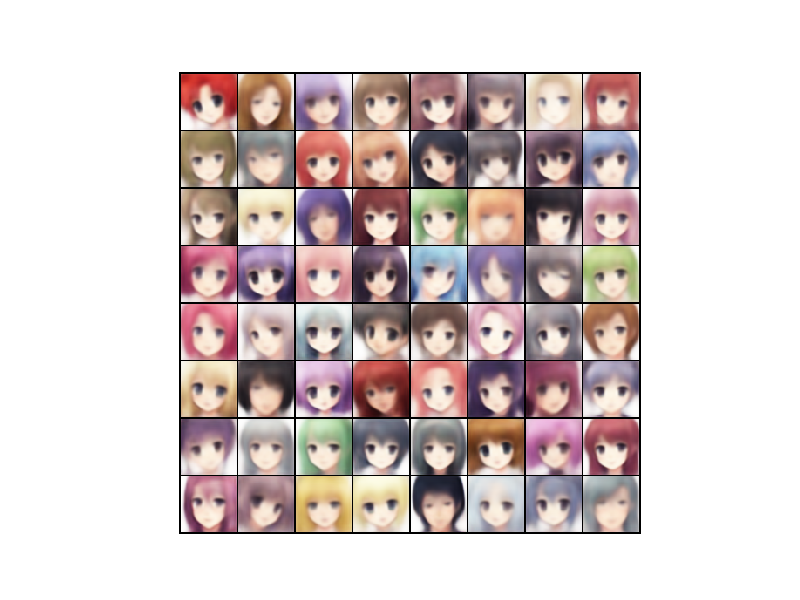
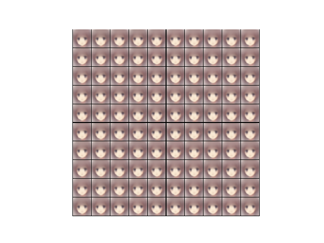

# Anime Face Generator

This little project tries to generate Anime Characters via a Convolutional Variational Autoencoder (VAE).
The dataset used for training was taken from [here](https://github.com/Mckinsey666/Anime-Face-Dataset) and contains 65.000 scraped characters.

<p align="center">



</p>

The idea of a VAE is that the encoder learns to approximate the posterior distribution *p(z|x)* where *z* is the latent space and x the input. Afterwards the decoder learns to reconstruct the image (*p(x|z)*). Here *z* is a 32-dimensional vector that is sampled from the learned multivariate Gaussian. I think the latent space could be a lot smaller without losing much reconstruction performance.
The network uses a few convolutional layers with max pooling for the compression. For the output of the encoder this flattened and fed into two fully connected layers to produce the mean and log variance for the sampling distribution. The upsampling process from *z* is done via transposed convolutions. To revert the effect of max pooling bilinear upsampling is utilized.
The loss for the optimization consists of two parts. First MSE is used to resemble the quality of the reconstructed images. Second Kullback-Leibler divergence regularizes the distributions of the latent space to be within reasonable distance of *N(0,1)*. In my case the KL-divergence had too much of an inpact, which resulted in mode collapse: 

<p align="center">

</p>

Therefore I introduced scaling and KL-annealing, which solved this issue.

### How to use ?
1. Clone the repository, install `requirements.txt` and navigate to `anime-autoencoder`. Don't forget to download the dataset an place the images in `./anime-autoencoder/data`.
```
git clone https://github.com/saiboxx/ml-showcases.git
pip install -r requirements.txt
cd anime-autoencoder
```
2. Start training. Available parameters are `--batch_size`, `--epochs` and `--fully_connected`. I don't recommend to use the fully connected version of the autoencoder, as this comes with millions of trainable parameters. In the end thats the reason why CNNs exist. Reconstructed and generated images will be saved every epoch.
```
python train.py --batch_size 128 --epochs 100
```


### Face Generator App
This tiny project also comes with an app for the actual generation of characters. I also included an already trained decoder.
Just navigate to `./anime-autoencoder/app` and start the docker image.
The page will be available on `http://0.0.0.0:5000/`.
Also there is the possibility of exploring the range of the latent space like for the morphed images in the above section. This is under `http://0.0.0.0:5000/explore`.
