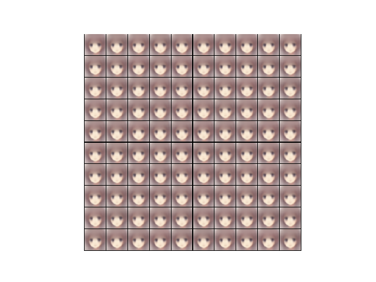

# Anime Face Generator

This little project tries to generate Anime Characters via a Convolutional Variational Autoencoder.
The dataset used for training was taken from [here](https://github.com/Mckinsey666/Anime-Face-Dataset) and contains 65.000 scraped characters.

So far the architecture itself works but it seems that the balance of reconstruction loss and KL-divergence is a bit off, which results in poor image generation.
I will tune hyperparameters in near future to solve this issue.

As it can be seen in the picture, the Decoder always generates the same image out of randomized latent space, which is not the intended behaviour.

### How to use ?
-->TBD<--

### Face Generator App
-->TBD<--
