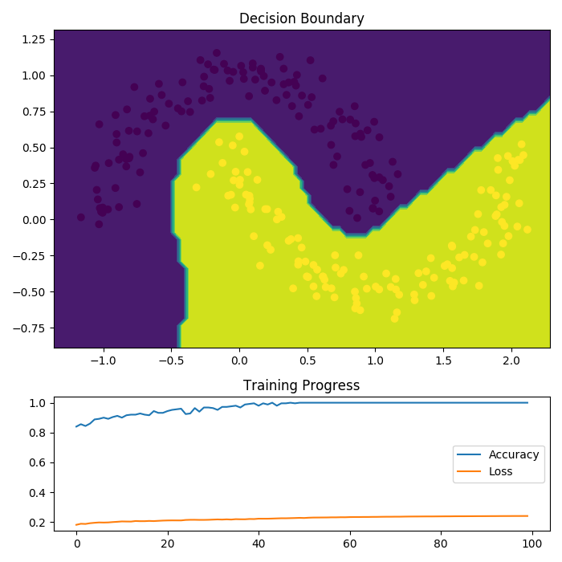
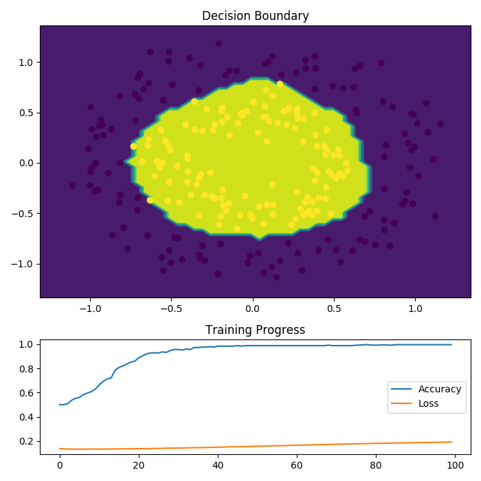

# Neural Network from Scratch

This repository implements a neural network solution from scratch. Well, not a 100% as I use the *numpy* library for matrix operations.
Nowadays big frameworks like *PyTorch* or *Tensorflow* with automated differentiation make it easy to create and train large architectures.
Subsequently a deep dive into maths and derivations is mostly not necessary anymore (at least for standard neural networks).
For educational reasons and curiosity I decided to implement a selection of modules from the ground up to see how basic mechanics function.
The goal was to build the components as modular as possible to allow a usage like its bigger brother *keras*.
As a result the toolbox provides building blocks for simple experiments and observations when changing parameters and the model layout.

### Supported Features

#### Layer

- Dense Layer

### Initialization

- He
- Glorot

#### Activations

- Sigmoid
- ReLU
- TanH

#### Losses

- Mean Squared Error (MSE)

#### Optimizer

- Stochastic Gradient Descent (SGD)

**WIP & Ideas:** Softmax, Crossentropy, Adam, Batch Normalization

### Examples

<p align="center">


</p>

The repository comes with two examples that can be produced by ```make moons``` and ```make circles```.
The plot shows the training progress and the resulting decision boundary.

### Build & train your model

It is recommended to check out ```binary_classification.py``` for the basic setup.
The basis is an instance of the ```NeuralNetwork``` class. Don't forget to do the imports.
- ```model = NeuralNetwork()```
- ```model.add(<Module>)```: Adds the passed module to the model layout.
- ```model.add_loss(<Loss>)```: Sets the specified loss function.
- ```optimizer = <optimizer>```: An optimizer needs to be instantiated.
- ```y_hat = model.forward(x)```: Propagate data through the model.
- ```model.get_loss(y, y_hat)```: Calculate the loss.
- ```model.backward()```: Backpropagation of the error through the model.
- ```optimizer.step(model)```: Apply gradients to the trainable parameters using the optimizer.
- ```model.zero_grads()```: Reset gradients before next batch.


### How to use ?
Clone the repository, install `requirements.txt` and navigate to `neural-from-scratch`.
If you only want to test the toolbox without the provided examples, *numpy* is the only required library.
```
git clone https://github.com/saiboxx/ml-showcases.git
pip install -r requirements.txt
cd neural-from-scratch
```